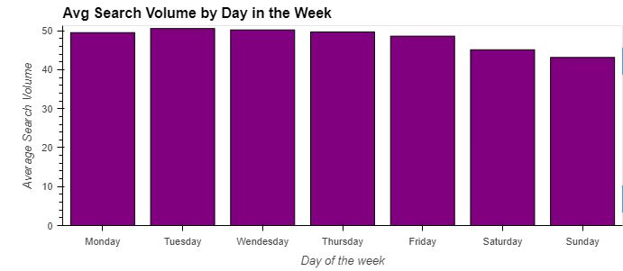
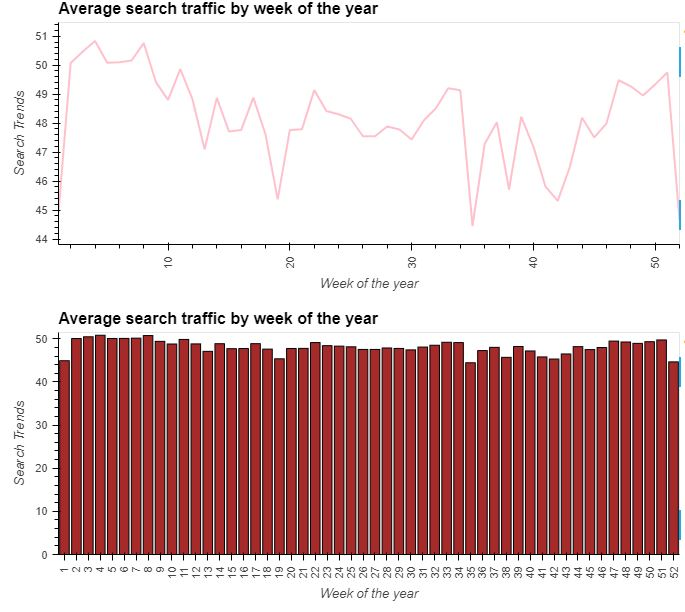
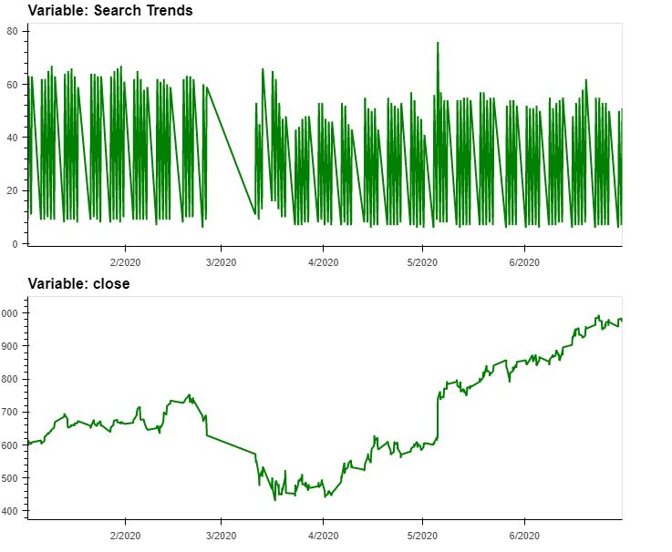
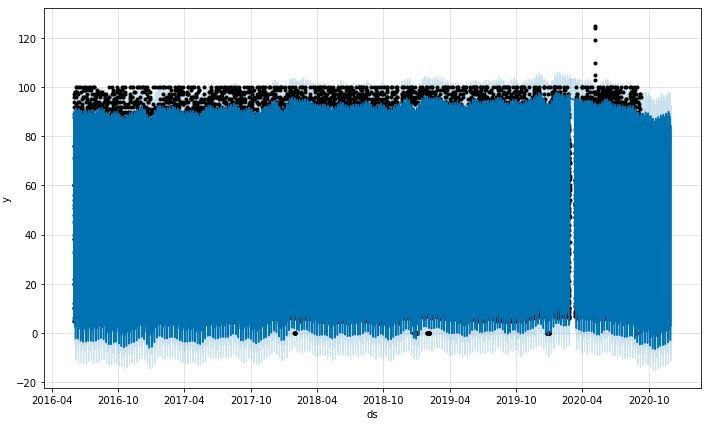

# Summary of Findings

* Based on visual above, the peak of search traffic is concentrated in the first few hours of the day (0-3) and the last few hours of the day (22 - 24).  During the day of the week, on the y-axis, weekdays appear to be busier in searches than weekends on average, but the hourly traffic patterns remain consistent throughout the week.

* Based on visual above, it appears over the weekends, there is a drop in search volume.

* Search traffic appears to trend higher between weeks 42 and 51, indicating seasonality by week for search traffic.  Traffic drops in week 52 and week 1, which could be due to the Holiday's and less people are using search engines.

* Both time series above indicate a common trend that’s consistent with the notion there is correlation between search trends and price. There's a drop in search and stock price between late February and mid-march.  Following sequentially, the search volume recovers and exceeds its previous levels beginning mid-March (3/13/2020) and the stock price bottoming out betwen mid-March and the beginning of April before an uptrend that lasts through the end of the dataset.

* Using Prohet to predict the trend; Prophet projects a downtrend in popularity for MercadoLibre Search for the 80 day projection followed by a rebound during the latter half of the projection period.
