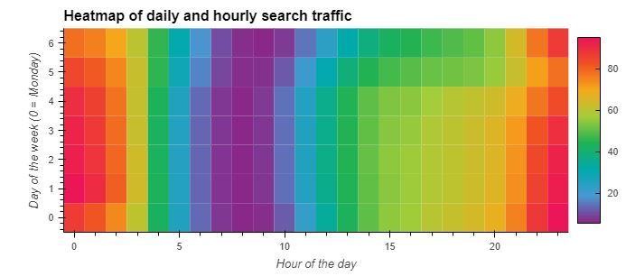

# Summary of Findings

* Based on visual above, the peak of search traffic is concentrated in the first few hours of the day (0-3) and the last few hours of the day (22 - 24).  During the day of the week, on the y-axis, weekdays appear to be busier in searches than weekends on average, but the hourly traffic patterns remain consistent throughout the week.
